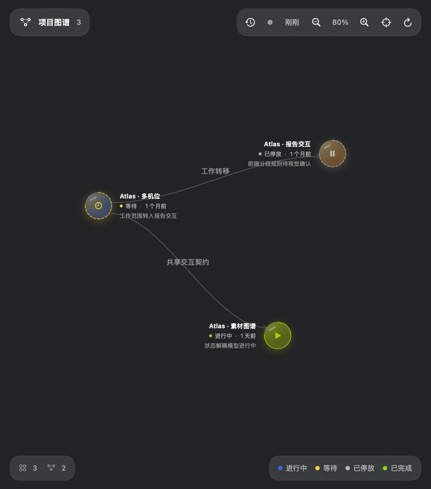
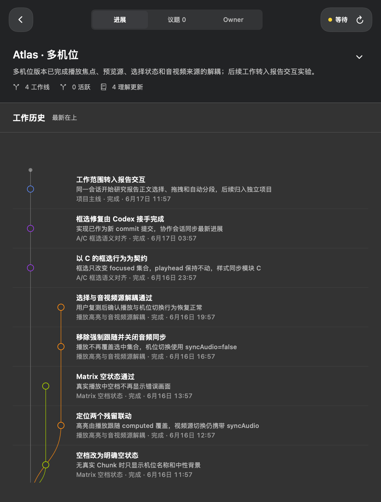
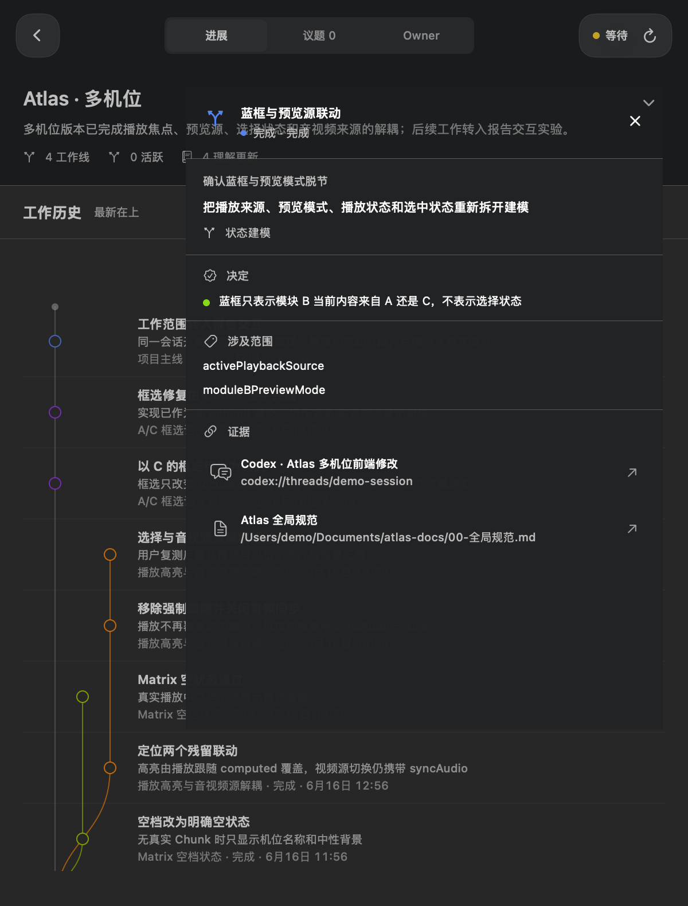

# Workstate

> 为长期人机协作保存“现在进行到哪”的本地 macOS 工作记忆。

Workstate 是一个菜单栏 macOS 应用。它持续读取已经完成的 Codex 对话，把分散在不同会话里的项目背景、任务分支、关键决定和实际进展，重新组织成可以查看和继续工作的项目状态。

它不是聊天记录浏览器，也不是待办清单。它更接近一套面向 AI 协作的本地版本控制：保留项目如何发展、任务从哪里分出、何时完成合流，以及每个结论来自哪段原始对话。



## 为什么做它

长期使用 AI 工作时，真正容易丢失的不是聊天记录，而是：

- 当前项目已经发展成什么样
- 哪些结论已经确认，哪些仍在讨论
- 同时推进的任务分别做到哪里
- 一次修改来自什么背景和原始要求
- 切换项目或压缩上下文后，下一步应该从哪里接手

Workstate 把这些信息从聊天时间线中提取出来，按实际项目和任务重新组织。

## 三层工作视图

### L1 · 项目图谱

以自由图谱查看所有项目、项目关系和最近状态。节点可以拖动，并通过颜色和状态区分正在进行、等待或长期未更新的项目。

每日工作摘要也从这里进入：每天上午 9 点总结上一自然日真正发生过变化的项目；没有新活动时不会生成空摘要。

### L2 · 项目状态

进入项目后，可以看到：

- 持续更新的项目背景与当前理解
- 最新在上的 Git 式工作历史
- 主线、并行任务及完成后的合流关系
- 尚未处理的议题和产品想法
- 与该项目 Project Owner 的独立对话



### L3 · 变化详情

点击任一节点，通过原生 macOS Popover 查看这次变化的结果、上下文、确认事项、运行状态、交付状态以及对应的原始对话。



## 后台如何工作

Workstate 将判断与写入拆成三层：

1. **Session Watcher** 只读取新完成的 Codex 对话片段。
2. **Portfolio Router** 判断内容属于哪个项目，不理解具体任务。
3. **Project Owner** 基于该项目已有背景，判断这是继续任务、新建支线、完成合流，还是更新项目理解。

最终状态由确定性的本地写入层校验和保存。无法识别的项目或工作线会直接失败，不通过模糊匹配猜测归属。

## 本地数据

项目状态、议题、Owner 对话、日报和来源定位保存在：

```text
~/.codex/workstate
```

这些运行数据不会写入 Git。Workstate 使用本机已经登录的 Codex 处理对话内容，因此模型分析仍会经过 Codex 服务。

## 构建与运行

要求：

- macOS 14 或更高版本
- Swift 6.2
- Node.js 18 或更高版本
- 已完成登录的 Codex

```bash
git clone https://github.com/zyshutim/workstate.git
cd workstate

npm install --prefix AgentRuntime
npm run build --prefix AgentRuntime
swift run WorkstateChecks

./scripts/build-app.sh
./scripts/install-daemon.sh --start
open dist/Workstate.app
```

## 当前状态

Workstate 目前是面向个人真实工作流开发的 MVP，已经在日常 Codex 项目中持续运行。

当前实现包括项目图谱、Git 式任务时间线、原始对话定位、项目议题、Project Owner 对话、每日工作摘要和自动会话监听。数据模型与安装方式仍可能继续调整，目前还没有经过公证的发行包。
