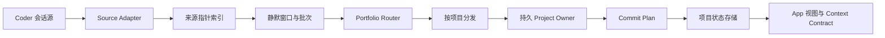

# Workstate 技术方案

> 日期：2026-08-03  
> 状态：目标架构已形成，部分代码仍在迁移  
> 产品规则以 [PRD](PRD.md) 为准，当前落地程度见 [实现状态](IMPLEMENTATION_STATUS.md)

## 1. 系统边界

Workstate 把 Coder 会话中的新增工作整理成可持续维护的项目记忆，并为用户界面和其他 Agent 提供同一份项目状态。

四类数据必须分开：

- 原始会话：事实证据，由原客户端保存。
- 来源索引：指向原始会话的精确位置，不复制完整对话。
- Workstate 项目状态：项目认知、工作概要、议题、工作线和历史。
- Agent Session：模型连续理解项目的工作缓存，不是最终事实来源。

Workstate 的持久项目状态具有最终权威。Agent Session 丢失后必须能从项目状态和证据索引恢复。

## 2. 目标流程



一次自动处理遵循以下顺序：

1. Source Adapter 发现新增且已经结束的会话轮次。
2. 系统只写入来源路径、会话、轮次、字节范围、时间和内容哈希。
3. 同一会话静默达到设定时间后，形成一个有高水位边界的批次。
4. Router 在单个会话内部按语义切分连续片段，并判断项目归属。
5. 已定性的片段按项目聚合，交给对应的持久 Project Owner。
6. Owner 在一次综合处理中维护项目结构并生成当前工作概要。
7. 系统先生成完整 Commit Plan，再原子写入项目状态，最后把来源指针标记为已处理。
8. App、搜索和交接文件读取写入后的同一份项目状态。

## 3. 监听与批次

监听阶段不能调用模型，也不能复制完整会话。它只增量扫描变化文件并更新来源指针。

批次规则：

- 一个 Router 批次只包含一个会话，禁止把多个会话按全局时间混合。
- 批次创建时记录高水位；处理期间产生的新内容进入下一批。
- 同一指针只能处于 `pending / batched / completed / failed` 之一。
- 自动处理失败后保留可诊断状态，不进行无限自动重试。
- 手动同步、上下文交接和冷启动可以显式触发处理，但仍走同一批次与写入协议。

目标产品参数是：项目相关工作静默约 2 小时后，由 Owner 生成工作概要。该概要与本批次的项目更新一起完成，不再额外调用独立的日报 Agent。实际静默时间由设置保存，后续可以调整。

## 4. Router

Router 只负责识别和分发，不理解项目内部应该如何推进。

它对单个会话批次执行：

- 将连续轮次切分为一个或多个语义片段。
- 结合会话最近上下文和历史绑定判断项目。
- 历史绑定是强提示，不是永久锁定；明确的项目切换可以覆盖旧绑定。
- 对每个语义片段返回 `ignore / carry / commit`。
- `carry` 表示内容仍在形成，暂存为开放语义包；`commit` 表示已经足够定性，可以交给 Owner。
- 发现新项目时只能提出最小项目草稿，后续理解由新项目的 Owner 负责。

Router 使用轻量模型。一次会话批次只调用一次 Router。

## 5. Project Owner

每个项目只有一个逻辑 Owner，并维护一个可恢复的持久 Session。日常更新、Owner 对话和项目认知草稿共享该项目的连续理解。

Owner 接收该项目已经定性的语义包和有上限的原始证据，并在一次处理中维护：

- 主线、并行工作线、完成与合流。
- 工作历史和需要在人类时间线上显示的转折点。
- 项目议题及其状态。
- 项目认知的待确认修改。
- 当前项目工作概要。

工作概要固定输出三组：

- 已完成。
- 正在进行。
- 待处理。

没有已确认的待处理事项时，Owner 可以给出一条标记为“建议”的下一步。建议不能自动变成用户决定。

Owner 可以整理事实和结果，不能替用户决定产品方向、优先级或取舍。长期项目认知只能由 Owner 提案，用户确认后才进入正式版本。

### 5.1 项目认知块契约

新客户端把项目认知作为块式文档处理。正式数据不能只保存一整段渲染后的 Markdown。

每个认知块至少包含：

- 稳定 Block ID。
- 内容与显示顺序。
- 该块的用途和更新边界。
- 证据来源。
- 所属认知版本。

块级修改以结构化操作保存，包括插入、更新、删除、拆分、合并和顺序调整。修改必须带 `baseVersion`，避免用户审阅期间被后续写入静默覆盖。批注单独保存，并锚定认知块或修改记录；批注不能混入正式认知正文。

Project Owner 只能产生待确认的块级修改。用户接受后生成新版本；拒绝或附带批注后保留审阅历史。前端的 Markdown 和行内划改都是该结构化数据的显示结果。

## 6. 其他 Agent

- Workstate 全局协调 Agent：处理跨项目问题，读取各项目已有概要，不重新总结全部项目证据。
- Persona Collaborator：维护用户 Persona、Agent Persona、协作 Rules、Skills 和 Loops；Agent 推断只能成为候选。
- Distill / Rebuild：只用于冷启动、历史重建和显式修复，不参与每次日常更新。
- 独立 Brief Composer：目标架构中移除，其职责并入 Project Owner。

## 7. 写入协议

自动处理必须先完成计算，再改变正式状态：

1. 锁定单个批次并记录来源指针。
2. Router 和 Owner 生成结构化结果。
3. 校验项目、工作线、来源、认知版本和状态转换。
4. 保存可恢复的 Commit Plan。
5. 原子写入项目状态。
6. 标记成功和失败的来源指针。
7. 清理批次临时结果。

崩溃恢复必须能够判断 Commit Plan 是否已经应用，避免同一批内容重复写入。一个来源批次可以包含多个项目的独立变更，但每条变更只能归属一个项目，不能引用其他项目的内部工作线。非法引用、重复 ID 和未知工作线应直接失败并保留诊断信息。

## 8. 持久化数据

当前本地根目录为：

```text
~/.codex/workstate
```

主要数据：

- `conversation-source-index.sqlite`：来源指针、扫描游标、批次、项目归属和开放语义包。
- `state.json`：当前项目状态快照。
- `events.jsonl`：有上限的状态变更记录。
- `project-owner-codex-sessions.json`：项目与 Codex Owner Session 的映射。
- `owner-conversations/`：用户与各 Project Owner 的可见聊天历史。
- `settings.json`：监听开关、静默时间和各 Agent 模型配置。
- `runtime-status.json`：当前监听和处理状态的轻量投影。
- `agent-runs.jsonl`：有上限的模型运行与 token 记录。
- `handoffs/`：显式生成的 Context Contract 和证据索引。

当前 `state.json` 仍会在状态变化时整体原子重写。是否把正式项目状态迁移到 SQLite 尚未决定；在做出迁移决定前，必须继续限制单次写入规模并监控文件增长。

## 9. Owner Session

当前适配器通过本机已登录的 Codex 启动或恢复 Project Owner 会话，并为每个项目保存一个 Codex Thread ID。

约束：

- Owner Session 只在对应项目内复用。
- Workstate 自己产生的 Agent 会话必须从来源监听中排除，避免系统处理自己的输出。
- Session 失效时只重建该项目，不影响其他项目。
- 新 Session 从正式项目认知、当前工作概要、活跃工作线、议题和有限的近期 Owner 对话恢复。
- Session 中的自由文本不能直接覆盖正式项目状态。

未来接入其他模型或 API 时，由 Session Adapter 替换 Codex 实现；上层 Project Owner 契约保持不变。

## 10. Context Contract

交接只在用户或 Coder 接手时生成，不随每轮会话重写。它包含：

- 正式项目认知。
- 当前项目工作概要。
- 当前工作线和项目议题。
- 相关协作规则。
- 关键转折与精确证据索引。

主 Markdown 保持可直接阅读；完整证据通过同名 `.sources.json` 回到原始会话。

## 11. 运行安全

- 文件监听和轮询不得触发模型调用；模型只由到期批次或显式用户操作触发。
- 同一时间只允许一个 Agent Worker 和一个写入批次。
- 限制每批指针数量、来源字节、Agent 请求和输出大小。
- 日志和临时结果必须轮转或覆盖，不能无限增长。
- 停止服务必须取消 watcher、timer、排队任务和正在运行的子进程。
- UI 只读取轻量投影，不能通过高频全量解码或动画持续占用 CPU。
- 监控重点是模型调用次数与 token、进程内存、CPU、运行目录大小、Crashpad 增长和失败重试次数。

## 12. 当前迁移边界

以下内容已经确认，但尚未全部落到代码：

- 独立日报改为 Owner 生成的项目工作概要。
- 工作概要改为“已完成、正在进行、待处理”。
- 固定 9 点日报调度退出主流程。
- 菜单栏主界面迁移为完整 macOS App。
- 状态栏改为按项目排序的单一动态流。
- 全局协调 Agent 和 Persona Collaborator 进入统一全局对话入口。
- 项目认知页升级为块式文档编辑器，并支持块级批注与行内修改对比。
- 其他 Coder 的自动来源适配器。
